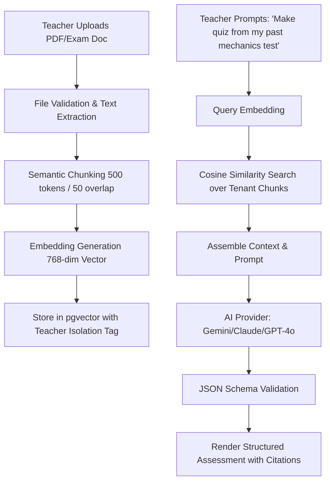

# TEACHER OS — AI Engine Architecture, RAG Pipeline & Safety Model

---

## 1. AI Layer Design Principles

1. **Provider-Agnostic Engine**: Decoupled interface preventing vendor lock-in (`IAIProvider`).
2. **Deterministic Output Enforcement**: All generation paths require strict JSON schema validation.
3. **No Unbounded Hallucination**: AI is prohibited from inventing student grades or modifying persistent records without human approval.
4. **Context-Bounded RAG**: Teacher Knowledge Vault embeddings enforce tenant isolation.

---

## 2. AI Autonomy Levels

```
┌───────────────────┬──────────────────────────────────┬──────────────────────────────────────────┐
│ Autonomy Level    │ Mode                             │ Allowed Operations                       │
├───────────────────┼──────────────────────────────────┼──────────────────────────────────────────┤
│ Level 1 (Suggest) │ Read-Only Intelligence           │ "My Intelligent Day" gap alerts, tips.   │
│ Level 2 (Draft)   │ Co-Pilot Interactive             │ AI Lesson Builder, Quiz Generator drafts.│
│ Level 3 (Confirm) │ High-Impact Human-in-the-Loop    │ Sending Parent WhatsApps, publishing tests│
│ Level 4 (Auto)    │ Background Statistical Pipelines │ Computing concept mastery matrices, RAG. │
└───────────────────┴──────────────────────────────────┴──────────────────────────────────────────┘
```

---

## 3. RAG Pipeline Architecture (Teacher Knowledge Vault)



---

## 4. Prompt Registry & Versioning Schema

All system prompts are registered as immutable, versioned objects containing:
- `promptId`: Unique identifier (e.g. `LESSON_GENERATOR_V1`, `ASSESSMENT_CREATOR_V1`, `MISTAKE_DIAGNOSER_V1`, `VOICE_INTENT_V1`).
- `inputSchema`: Parameters required (Subject, Grade, Concept, Difficulty, Count).
- `outputSchema`: Strict JSON schema expected.
- `safetyRules`: Content moderation and guardrail directives.
