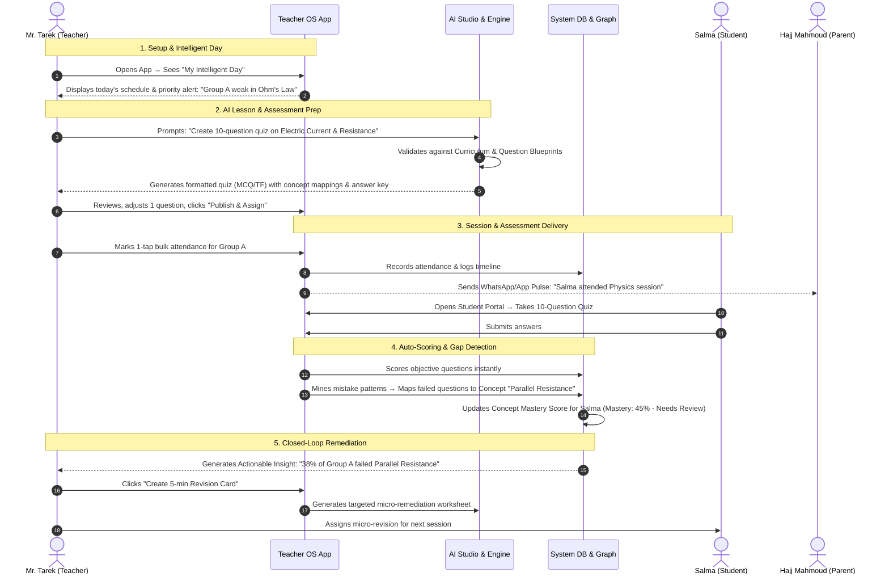

# TEACHER OS — User Journeys & Workflow Specifications

---

## 1. Teacher End-to-End Journey: The Closed-Loop Flow

---

## 2. Student Onboarding & Daily Learning Journey

1. **Invitation & Access**: Student enters unique Academic Code or phone number provided by the teacher.
2. **"My Learning Day" Dashboard**:
   - Next Session countdown & location.
   - Pending Homework & Active Quizzes.
   - Concept Health Radar: Strong concepts (Green) vs Concepts requiring review (Amber/Red).
3. **Interactive Socratic Quiz Experience**:
   - Time-bounded quiz interface.
   - Immediate explanatory feedback on submission.
   - "Ask AI Coach" for pedagogical hints on missed questions (without giving the direct solution).

---

## 3. Parent "Child Pulse" Journey

1. **Authentication**: Instant login via verified phone number (OTP).
2. **Child Card Overview**:
   - Single-screen summary per child.
   - Pulse Indicator: **"Good" (ممتاز)** / **"Needs Attention" (يحتاج متابعة)** / **"Action Recommended" (إجراء مطلوب)**.
3. **Transparent Event Feed**:
   - Attendance history (Session date, arrival status).
   - Homework submissions & Assessment scores.
   - Payment status (Paid / Due with 1-tap InstaPay/Fawry receipt verification).
